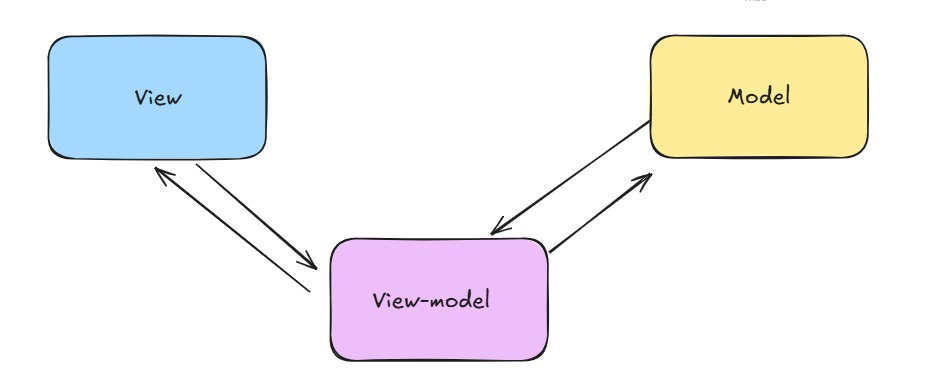

<div align="center">

&nbsp;&nbsp;

<h1 align="center">Villa Gourmet 🥗🍔🍝</h1>
&nbsp;&nbsp;
</div>

## 🚀 Sobre o projeto

Aplicação de catálogo de pratos com filtros dinâmicos, carrinho e página com informações detalhadas de um prato.

</br>

## 🧰 Pré-requisitos

- Node.js
- VSCode ou editor da sua preferência

</br>

## 🔧 Tecnologias utilizadas

- Next.js
- Typescript
- Axios
- Tailwind
- Zustand
- Framer Motion

</br>

## 🧭 Como executar o projeto?

```bash
# Clone este repositório
$ git clone https://github.com/lorraynefirme/Villa-Gourmet.git

# Acesse a pasta do projeto no terminal/cmd
$ cd <nome_da_pasta>

# Instale as dependências
$ npm install

# Execute a aplicação em modo de desenvolvimento
$ npm run dev
```

&nbsp;&nbsp;

## ☕ Arquitetura MVVM

<div  align="center">
</br>
    
    
</div>
</br>

<div>
<p>
A arquitetura MVVM promove uma separação clara entre a interface e a lógica de negócios, permitindo a criação de aplicativos mais organizados, testáveis e fáceis de manter.
</p>
</div>
</br>

## 1️⃣ View

Responsável pela apresentação dos dados para o usuário. A View contém os elementos de interface (como botões, listas, formulários) e interage com o usuário, mas não deve conter lógica de negócios.
</br>
</br>

Exemplo:

```bash
export const ProductCounter = () => {
  const { count, setCount, productDetails, loading } =
    useProductCounterViewModel();

  return (
    <div>
      <h1>{productDetails.name}</h1>
      <div className="flex flex-row">
        <button
          className="bg-slate-500"
          disabled={loading}
          onClick={() => setCount((prev) => prev - 1)}
        >
          -
        </button>
        <p>{count}</p>
        <button
          className="bg-slate-500"
          disabled={loading}
          onClick={() => setCount((prev) => prev + 1)}
        >
          +
        </button>
      </div>
    </div>
  );
};
```

## 2️⃣ View-Model

Atua como intermediário entre a Model e a View. Ele expõe os dados da Model de forma que a View consiga consumi-los facilmente e implementa comandos e lógica de apresentação.
</br>
</br>

Exemplo:

```bash
export const useProductCounterViewModel = () => {
  const { id } = useParams();
  const [count, setCount] = useState(0);
  const [loading, setLoading] = useState(true);
  const [productDetails, setProductDetails] = useState<ProductModel>(
    new ProductModel()
  );

   useEffect(() => {
    getProductDetailsById()
  }, [])

  const getProductDetailsById = async () => {
    try {
      const response = await ProductModel.getProductById(id);
      if (response) {
        setProductDetails(response.data);
      }
    } catch (error) {
      if (error instanceof AxiosError || error instanceof Error) {
        throw new Error(error.message);
      } else {
        throw new Error("Erro desconhecido");
      }
    } finally {
      setLoading(false);
    }
  };

  return {
    count,
    setCount,
    productDetails,
    loading,
  };
};
```

## 3️⃣ Model

Representa os dados e a lógica de negócios da aplicação. Essa camada é independente da interface e lida com a comunicação com fontes de dados (bancos de dados, APIs, session storage, local storage e etc.).
</br>
</br>

Exemplo:

```bash
export class ProductModel {
  constructor(
    readonly id: number = -1,
    readonly name: string = ""
  ) {}

  static getProductById = async (
    id: string
  ): Promise<{ data: ProductModel }> => {
    try {
      const response = await onGetProductById(id);

      if (response) {
        const product = response.data;
        const data = new ProductModel(product.id, product.name);

        return { data };
      } else {
        throw new Error("Erro ao buscar dados na API");
      }
    } catch (error) {
      throw new Error("Erro ao buscar dados na API");
    }
  };
}
```

</br>

## 🎯 Benefícios da Arquitetura MVVM

<ul>
  <li>Separa bem as responsabilidades (Modelo, Lógica e UI)</li>
  <li>A Model encapsula as regras de negócio (métodos da classe)</li>
  <li>Fácil de testar, pois a lógica está desacoplada da UI</li>
  <li>Fácil adaptação e aprendizado no time de desenvolvimento</li>
</ul>
